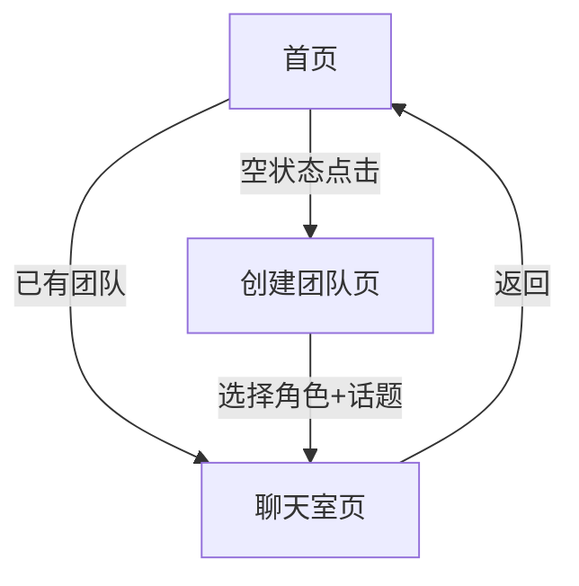

## 1. Product Overview
Dream Room 是一个单页面 Web 应用原型，让用户创建由 2-3 个 AI 偶像组成的虚拟智囊团，观看他们围绕话题进行群聊。产品通过模拟多角色人格化对话，为用户提供娱乐性和启发性的交互体验。

目标用户：对 AI 对话、名人文化、创意娱乐感兴趣的互联网用户。核心价值：以低成本方式体验多角色 AI 对话的乐趣，无需真实大模型即可感受"圆桌会议"氛围。

## 2. Core Features

### 2.1 User Roles
无需用户注册，所有功能对访客开放。localStorage 可选保存用户创建的团队数据。

### 2.2 Feature Module
Dream Room 包含以下核心页面：
1. **首页**：展示"我的智囊团"列表，空状态引导创建
2. **创建团队页**：选择 2-3 个 AI 角色，输入讨论话题，开始圆桌会议
3. **聊天室页**：垂直聊天窗口，模拟 AI 轮流发言，用户可插话提问

### 2.3 Page Details
| Page Name | Module Name | Feature description |
|-----------|-------------|---------------------|
| 首页 | 智囊团列表 | 展示用户创建的所有智囊团卡片，空状态显示引导按钮"创建第一个智囊团" |
| 首页 | 导航栏 | 显示应用标题，可选深色/浅色模式切换按钮 |
| 创建团队页 | 角色选择区 | 从预设角色列表勾选 2-3 个角色，显示头像、名字、标签，支持取消选择 |
| 创建团队页 | 话题输入区 | 单行文本框输入讨论话题，占位符提示"例如：AI 会毁灭人类吗？" |
| 创建团队页 | 开始按钮 | 满足选择角色且输入话题后激活，点击跳转聊天室 |
| 聊天室页 | 聊天窗口 | 垂直滚动消息列表，显示角色头像、名字、聊天气泡，不同角色用不同边框颜色区分 |
| 聊天室页 | 消息流控制 | 系统开场后，角色按顺序每 1.5 秒自动发言，模拟思考间隔 |
| 聊天室页 | 用户输入区 | 底部固定输入框，用户可发送问题，AI 随机回复对应角色话术 |
| 聊天室页 | 返回按钮 | 返回首页，保留当前团队记录到 localStorage |

## 3. Core Process
用户首次进入首页，看到空状态引导。点击"创建第一个智囊团"进入创建页，依次选择角色、输入话题，点击"开始圆桌会议"进入聊天室。系统自动开场后，AI 角色轮流发言，用户可随时提问，AI 会随机回复。聊天结束后可返回首页查看已创建的智囊团。

## 4. User Interface Design

### 4.1 Design Style
- 主色： slate-900（深色背景）/ slate-50（浅色背景）
- 辅色： emerald-500（强调按钮）、sky-500（链接）、amber-500（警告）
- 按钮：圆角 medium，hover 微阴影，主按钮填充，次按钮边框
- 字体：系统默认，标题 text-2xl，正文 text-base，提示 text-sm
- 布局：全屏卡片式，最大宽度 4xl，水平居中，垂直滚动
- 图标：heroicons 线性风格，角色头像圆形裁剪

### 4.2 Page Design Overview
| Page Name | Module Name | UI Elements |
|-------------|---------------|-------------|
| 首页 | 智囊团列表 | 深色/浅色模式切换按钮置右上角，标题居中，卡片网格 2 列（桌面）/1 列（移动），卡片含角色头像拼贴、团队名称、话题摘要 |
| 创建团队页 | 角色选择区 | 角色卡片横向滚动，头像 64px，名称 bold，标签小圆点，选中状态绿色边框+check 图标 |
| 创建团队页 | 话题输入区 | 输入框全宽，圆角 large，底部计数器显示已选角色数/3 |
| 聊天室页 | 聊天窗口 | 消息气泡最大宽度 3/4，左对齐系统/用户，右对齐 AI 角色，边框颜色：马斯克 emerald、爱因斯坦 sky、鲁迅 rose、科比 amber |
| 聊天室页 | 用户输入区 | 输入框贴底，圆角 full，发送按钮图标，禁用状态灰色 |

### 4.3 Responsiveness
桌面优先，断点 sm: 640px、md: 768px、lg: 1024px。聊天窗口在移动端全宽，角色头像缩小至 40px，创建页角色选择改为 2 列网格。