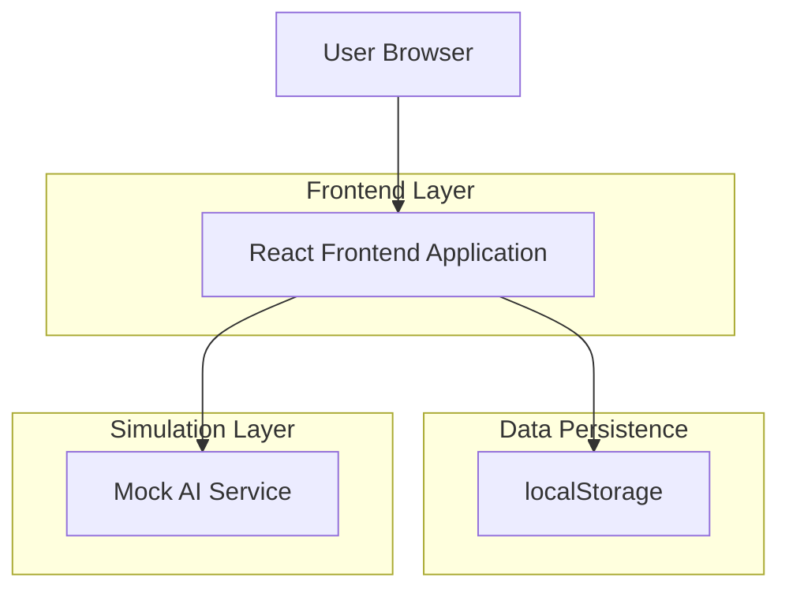
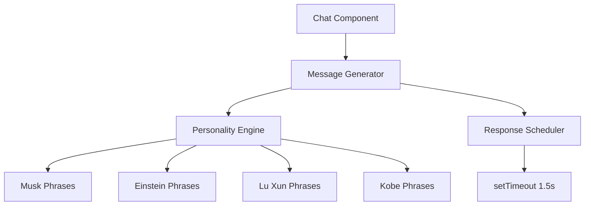

## 1. Architecture design


## 2. Technology Description
- Frontend: React@18 + tailwindcss@3 + vite
- Initialization Tool: vite-init
- Backend: None（纯前端模拟）
- 状态管理：React hooks（useState, useEffect）
- 路由：React Router v6（单页应用）

## 3. Route definitions
| Route | Purpose |
|-------|---------|
| / | 首页，展示智囊团列表 |
| /create | 创建团队页，选择角色与话题 |
| /chat/:teamId | 聊天室页，展示 AI 群聊 |

## 4. Core TypeScript Types
```typescript
interface Character {
  id: string;
  name: string;
  avatar: string;
  tag: string;
  personality: 'musk' | 'einstein' | 'luxun' | 'kobe';
  color: string;
}

interface Team {
  id: string;
  name: string;
  topic: string;
  characters: Character[];
  createdAt: number;
}

interface Message {
  id: string;
  sender: 'system' | 'user' | Character;
  content: string;
  timestamp: number;
}

interface ChatState {
  messages: Message[];
  isTyping: boolean;
  currentSpeakerIndex: number;
}
```

## 5. Mock AI Service Architecture


## 6. Data Model（localStorage）
### 6.1 存储结构
```typescript
// teams 数组结构
interface StoredTeams {
  teams: Team[];
  lastVisit: number;
}

// messages 按 teamId 分桶
interface StoredMessages {
  [teamId: string]: Message[];
}
```

### 6.2 初始化数据
预设角色数据：
```javascript
const characters = [
  {
    id: 'musk',
    name: '埃隆·马斯克',
    avatar: '/avatars/musk.jpg',
    tag: '科技狂人',
    personality: 'musk',
    color: 'emerald',
    phrases: [
      '第一性原理告诉我们，{topic} 的本质是...',
      'Hardcore！我们要在火星上讨论 {topic}',
      'AI 就像核弹，必须开源！'
    ]
  },
  {
    id: 'einstein',
    name: '阿尔伯特·爱因斯坦',
    avatar: '/avatars/einstein.jpg',
    tag: '物理之神',
    personality: 'einstein',
    color: 'sky',
    phrases: [
      '上帝不掷骰子，但 {topic} 确实充满不确定性',
      '想象力比知识更重要，让我想象一个关于 {topic} 的比喻...',
      '相对论告诉我们，{topic} 没有绝对答案'
    ]
  },
  {
    id: 'luxun',
    name: '鲁迅',
    avatar: '/avatars/luxun.jpg',
    tag: '民族魂',
    personality: 'luxun',
    color: 'rose',
    phrases: [
      '呵呵，{topic}？从来如此，便对么？',
      '我向来不惮以最坏的恶意来推测 {topic}',
      '世上本没有路，讨论的人多了，也便成了路'
    ]
  },
  {
    id: 'kobe',
    name: '科比·布莱恩特',
    avatar: '/avatars/kobe.jpg',
    tag: '黑曼巴',
    personality: 'kobe',
    color: 'amber',
    phrases: [
      '凌晨四点的洛杉矶告诉我，{topic} 需要曼巴精神',
      '如果你害怕 {topic}，你就已经输了',
      ' greatness 需要每天努力，就像我练习投篮一样'
    ]
  }
];
```